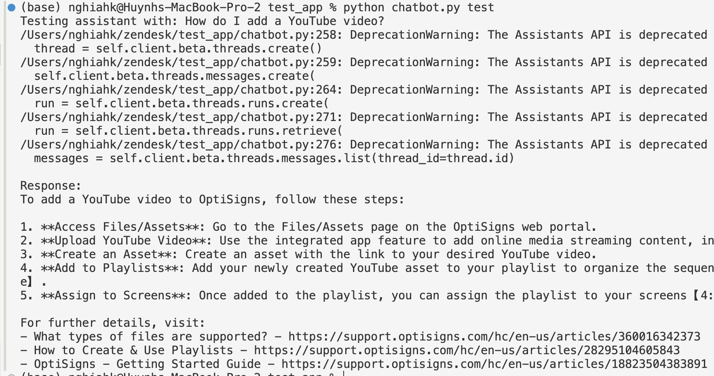

# Article Scraper & Uploader

Automated system to scrape Zendesk articles and upload them to an OpenAI Assistant vector store.

## Setup

### 1. Environment Configuration

Copy the sample and edit your .env:

```bash
cp .env.sample .env
```

Then edit .env with your configuration. Just make sure that you fill up all the configuration before running the application:

```
ASSISTANT_ID
VECTOR_STORE_ID
OPENAI_API_KEY=
BASE_URL=https://support.company.com
MAX_ARTICLES=30
ASSISTANT_INSTRUCTIONS=You are chatbot,...
```

You can get ASSISTANT_ID and VECTOR_STORE_ID by creating them on https://platform.openai.com/assistants and https://platform.openai.com/storage/vector_stores or by running:

```bash
python initial_setup.py
```

- `initial_setup.py` will create a new assistant and vector store, and update your .env file automatically.

## How to Run

You can run the full pipeline with one command, use Docker, or run each step separately for more control.

### 1. Run Everything (Full Pipeline)

```bash
python main.py
```
Or override API key:
```bash
OPENAI_API_KEY=your_openai_api_key_here python main.py
```
### 2. Run with Docker

Build the Docker image:
```bash
docker build -t chatbot .
```
Run the full pipeline using .env for configuration:
```bash
docker run --rm --env-file .env chatbot python main.py
```
Or override API key directly:
```bash
docker run --rm -e OPENAI_API_KEY=your_openai_api_key_here chatbot python main.py
```

### 3. Run Each Step Separately

#### a. Scraper (Node.js)

Change to the src directory:
```bash
cd src
```
Install dependencies:
```bash
npm install
```
Run the scraper:
```bash
node scraper-cli.js
```

#### b. Uploader (Python)

Install Python dependencies:
```bash
pip install -r requirements.txt
```
Run the uploader:
```bash
python chatbot.py update
```

#### c. Test the Chatbot (Python)

Run chatbot test (you can modify the question in chatbot.py as needed):
```bash
python chatbot.py test
```

#### d. List or Clean Up OpenAI Resources

List all assistants, vector stores, and files:
```bash
python cleanup.py list
```
Delete all assistants, vector stores, and files (DANGEROUS):
```bash
python cleanup.py all
```
#### Warning

If you run the app separately and get wrong logic (wrong update, scraper, etc.), just remove the following files, clean up the OpenAI Resources, and run all again.

```bash
rm -rf articles reports .bot_cache.json
```

## Daily Job Logs

- [Local Reports](reports/latest_log.json)

## Output

- Individual Markdown files for each article
- Organized folder structure by category/section
- Complete frontmatter with article metadata
- Index file listing all scraped articles
## Sample
The chatbot answer to question: "How do I add a Youtube video ?"

## Reference

- Node.js 14+ (for scraping)
- Python 3.8+ (for uploading)
- Docker (optional, for containerized runs)
- Internet connection to access the help center and OpenAI API

### Script Roles

- **scraper-cli.js**: Downloads articles from Zendesk and saves them as Markdown.
- **chatbot.py**: Uploads articles to OpenAI vector store and can test the chatbot.
- **initial_setup.py**: Creates a new assistant and vector store, and updates your .env.
- **cleanup.py**: Lists or deletes all OpenAI resources (assistants, vector stores, files).
- **main.py**: Orchestrates the full pipeline (scraping + uploading).

### Troubleshooting

- If you see errors about missing environment variables, check your `.env` file.
- If you get authentication errors, verify your `OPENAI_API_KEY`.
- If you get rate limit errors, try reducing `MAX_ARTICLES` or increasing delay in your scraper.
